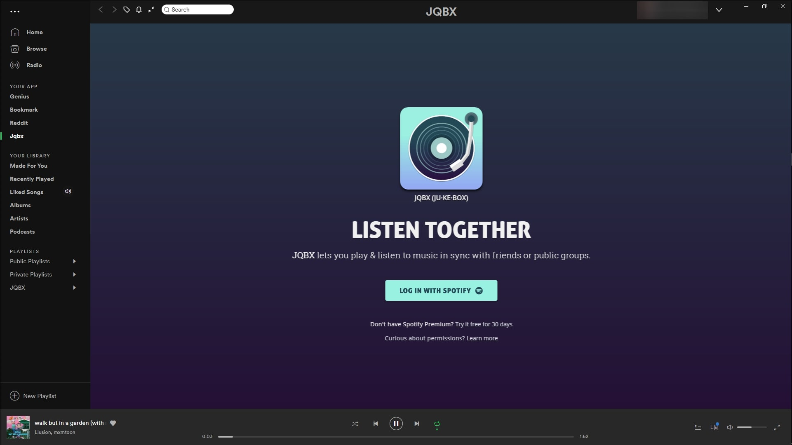

JQBX within Spotify
===================

This is a very simple [spicetify][spicetify] custom app that adds a [JQBX](https://jqbx.fm) tab in your spotify desktop app.



How to install
--------------

1. You need to have [spicetify][spicetify] installed. (this app will only work with the newest version of spicetify. For the legacy version, check out the [`legacy` branch](https://github.com/Kasama/spicetify-jqbx/tree/legacy))
2. Clone this repository using `git clone https://github.com/Kasama/spicetify-jqbx.git jqbx` into your [spicetify custom apps directory](https://github.com/khanhas/spicetify-cli/wiki/Custom-Apps) or unzip the [latest release][release] in the correct directory depending on your OS.
The folder name will need to be renamed to `jqbx`.

  Windows: `%userprofile%\.spicetify\CustomApps\`

  Linux: `$XDG_CONFIG_HOME/.config/spicetify/CustomApps/` or `~/.config/spicetify/CustomApps`

  MacOS: `~/spicetify_data/CustomApps`

3. Add the app to your spotify by running `spicetify config custom_apps jqbx` or change your `config.ini` to include the `jqbx` app folder.

```ini
[AdditionalOptions]
...
custom_apps = jqbx
```

4. Run `spicetify apply`
5. Open spotify

[spicetify]: https://github.com/khanhas/spicetify-cli/
[release]: https://github.com/Kasama/spicetify-jqbx/archive/v2.0.0.zip
